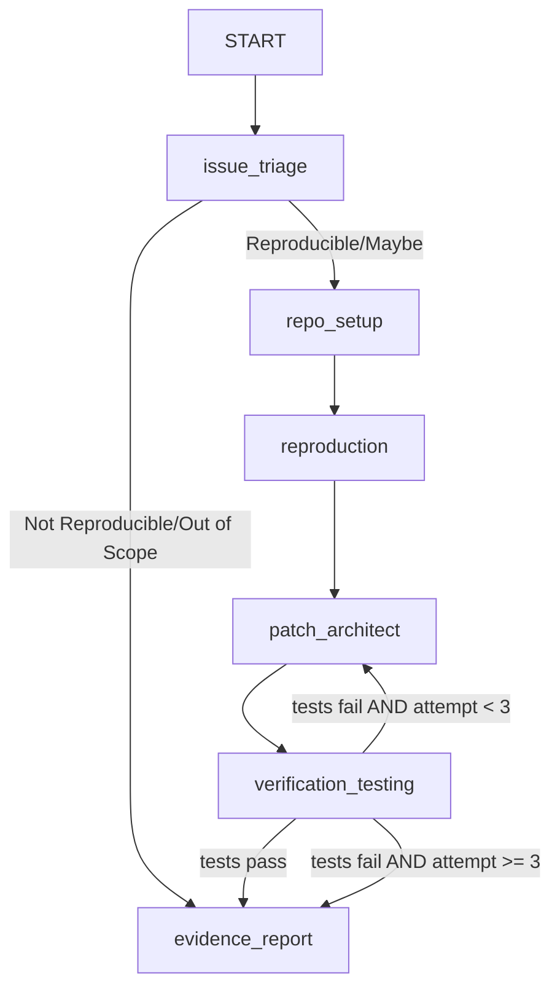

# BugRepro Sentinel: Verified AI Bug Fixing Agent

BugRepro Sentinel is an autonomous DevSecOps agent system built on Google's **Agent Development Kit (ADK 2.0)**. Its objective is to help volunteer maintainers of public-good open-source Python projects by automatically triaging, reproducing, patching, and verifying bug fixes inside a secure, fully sandboxed Docker container (no host mounts).

All operations (cloning, dependency installation, running command lines, writing files, and running test suites) run entirely within an isolated Docker container workspace with zero host filesystem mounts to ensure absolute isolation from untrusted repository code.

---

## 🚀 Multi-Stage Roadmap

1. **Stage 1 (Current)**: Core BugRepro Sentinel Agents, Sandbox Tools, and CLI runner.
   * **Step 1**: Project Setup & Scaffolding `[COMPLETED]`
   * **Step 2**: Sandbox Engine Development (`sandbox.py`) `[COMPLETED]`
   * **Step 3**: Core Tools Implementation (`tools.py`) `[COMPLETED]`
   * **Step 4**: Agent Graph Orchestration (`agent.py`) `[COMPLETED]`
   * **Step 5**: Demo Verification `[COMPLETED]` (Validating against issue #2081)
2. **Stage 2**: Web Frontend & Backend API Server (FastAPI hosting the ADK runner).`[PENDING]`
3. **Stage 3**: Cloud Deployment (Deploying Backend & Frontend to Cloud).
4. **Stage 4**: Multi-repo & Node.js Support.

---

## 🏗️ Stage 1 Architecture

BugRepro Sentinel utilizes a directed state graph managed by the ADK 2.0 Workflows API. State is shared via a schema-validated Pydantic model (`BugReproState`) passed between 5 coordinated agents:



1. **`issue_triage`**: Uses an LLM to parse the GitHub issue URL and determine if it is reproducible/in-scope. Extracts error stack traces and CLI keywords.
2. **`repo_setup`**: Launches the Python Docker container and clones the repository directly into `/workspace` inside the container.
3. **`reproduction`**: Writes a standalone reproduction test case (`test_repro.py`) inside the container and confirms it fails (exit code != 0).
4. **`patch_architect`**: Scans the directory using tools, reads files mentioned in the traceback, proposes a minimal fix, and overwrites the files inside the container.
5. **`verification_testing`**: Runs `pytest test_repro.py` and the project test suite inside the container. If tests fail, it loops back up to 3 times to find alternative fixes.
6. **`evidence_report`**: Compiles the final report formatted as a **Maintainer-Ready GitHub Comment** (with diff and community impact section). Copies the report and the generated `.patch` file out of the container to the host `artifacts/` folder, and yields it as an event.

---

## 🔒 Security Boundary Policy

To prevent arbitrary code execution (like malicious pre/post-install hooks or test scripts) from affecting the developer's machine:

* **Zero Host Mounts**: No folders on the host are mounted to the container. Git clones, builds, and test runs are kept strictly inside the container's isolated virtual filesystem.
* **Blank Environments**: Host-level environment variables (including Google API keys and GitHub tokens) are never leaked to the sandbox container.
* **Command Sanitization**: Execution commands are passed as strict argument lists (e.g. `["pip", "install", "-r", "requirements.txt"]`) bypassing shell expansion. String commands are checked programmatically to block chaining (`&&`, `;`, `|`).
* **Regex Input Validation**: Target file edits and paths are validated in Python, preventing prompt-injected writes.

---

## 📦 Current Status: Step 4 (Agent Graph Orchestration)

* **Step 1 (Scaffolding & Setup)** `[COMPLETED]`: Scaffolded ADK project under `bugrepro-agent/`.
* **Step 2 (Sandbox Engine)** `[COMPLETED]`: Developed isolated `DockerSandbox` in `sandbox.py` and passed lifecycle tests.
* **Step 3 (Core Tools)** `[COMPLETED]`: Developed custom tools in `tools.py` for issue fetching, sandbox execution, reading/writing, and patching files, passing unit tests.
* **Step 4 (Agent Orchestration)** `[COMPLETED]`: Configured a 5-agent sequential orchestration (`SequentialAgent` in `agent.py`) using Triage, Setup, Reproduction, Patch, and Verification specialist agents with automatic sandbox cleanup.
* **Step 5 (Validation Target)** `[PENDING]`: Ready for End-to-End verification targeting GitHub issue [#2081](https://github.com/google/adk-samples/issues/2081) (TypeError/ignoring return value in `before_tool` callback's lowercasing helper).
* Virtual environment synchronized via `uv sync`.

---

## 🛠️ Local Development (Stage 1)

Prerequisites

* Python 3.11+
* Docker running on the host system
* `uv` installed (`pip install uv`)

### Setup

1. Clone this repository.
2. Synchronize dependencies:
   ```bash
   cd bugrepro-agent
   uv sync
   ```
