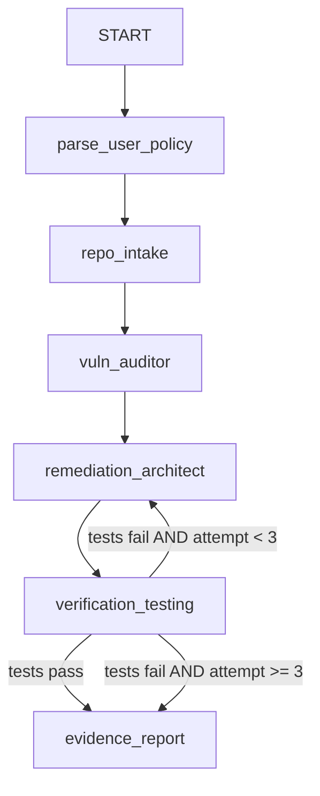

# Patchguard: OSV Automation Fleet

Patchguard is an advanced, multi-agent DevSecOps orchestration system built on Google's **Agent Development Kit (ADK 2.0)**. Its objective is to securely ingest a repository, audit its dependencies against the live OSV database, automatically calculate and apply safe upgrades, execute native test suites, and produce a verified proof report.

All operations (cloning, dependency analysis, code editing, package installation, and test suite execution) run entirely within a secure, non-privileged Docker container workspace with zero host filesystem mounts to ensure absolute isolation from untrusted repository code.

---

## 🚀 Multi-Stage Roadmap

1. **Stage 1 (Current)**: Core Patchguard Agents, Tools, and CLI runner.
   * **Step 1**: Project Setup & Scaffolding `[COMPLETED]`
   * **Step 2**: Sandbox Engine Development (`sandbox.py`) `[PENDING]`
   * **Step 3**: Core Tools Implementation (`tools.py`) `[PENDING]`
   * **Step 4**: Agent Graph Orchestration (`agent.py`) `[PENDING]`
   * **Step 5**: Live Demo Verification `[PENDING]`
2. **Stage 2**: Web Frontend & Backend API Server (FastAPI hosting the ADK runner).
3. **Stage 3**: Cloud Deployment (Deploying Backend & Frontend to Google Cloud).
4. **Stage 4**: BugRepro Sentinel Integration.

---

## 🏗️ Stage 1 Architecture

Patchguard utilizes a directed state graph managed by the ADK 2.0 Workflows API. State is shared via a schema-validated Pydantic model (`PatchguardState`) passed between 5 coordinated agents:



1. **`parse_user_policy`**: Parses natural language constraints (e.g. *"Do not upgrade past minor versions"*) into a structured Pydantic configuration.
2. **`repo_intake`**: Detects package type (Python vs Node.js), spins up the corresponding Docker image, and clones the repository inside it. Captured the fully resolved dependency baseline.
3. **`vuln_auditor`**: Queries the live OSV API concurrently and filters vulnerabilities against the parsed policy rules.
4. **`remediation_architect`**: Calculates optimal safe version upgrades, creates Git branches, and overwrites dependency pins inside the container.
5. **`verification_testing`**: Runs installation and native tests (`pytest` / `npm test`) inside the sandbox. If tests fail, it increments the attempt count and loops back up to 3 times to find alternative paths.
6. **`evidence_report`**: Extracts logs, reports, and `.patch` files from the sandbox and copies them back to the host `artifacts/` folder.

---

## 🔒 Security Boundary Policy

To prevent arbitrary code execution (like malicious pre/post-install hooks or test scripts) from affecting the developer's machine:
* **Zero Host Mounts**: No folders on the host are mounted to the container. Git clones, builds, and test runs are kept strictly inside the container's isolated virtual filesystem.
* **Blank Environments**: Host-level environment variables (including Google API keys and GitHub tokens) are never leaked to the sandbox container.
* **Command Sanitization**: Execution commands are passed as strict argument lists (e.g. `["pip", "install", "-r", "requirements.txt"]`) bypassing shell expansion. String commands are checked programmatically to block chaining (`&&`, `;`, `|`).
* **Regex Input Validation**: Target upgrade versions are validated via regex (e.g., matching a strict semantic version schema) before modification, preventing prompt-injected writes.

---

## 📦 Current Status: Step 1 (Scaffolding & Setup)
* Boilerplate generated via `agents-cli scaffold` under `patchguard-agent/`.
* Dependency configurations defined in `pyproject.toml` including:
  * `google-adk[gcp]`
  * `docker` (Python SDK for container management)
  * `httpx` (HTTP client for querying OSV)
* Virtual environment synchronized via `uv sync`.

---

## 🛠️ Local Development (Stage 1)

### Prerequisites
* Python 3.11+
* Docker running on the host system
* `uv` installed (`pip install uv`)

### Setup
1. Clone this repository.
2. Synchronize dependencies:
   ```bash
   cd patchguard-agent
   uv sync
   ```
