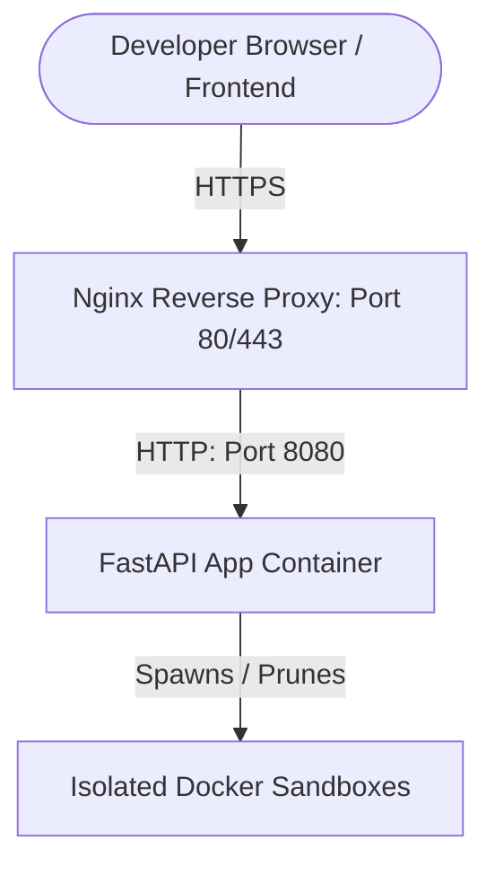

# Google Cloud Deployment Guide: BugRepro Sentinel Backend

This guide outlines the step-by-step process for deploying the Docker-enabled FastAPI backend API server (`bugrepro-agent`) to Google Cloud Platform (GCP) using a free Let's Encrypt SSL certificate.

---

## 🏗️ Deployment Architecture

Because the backend dynamically spins up and tears down isolated Docker containers for each issue reproduction run, serverless targets (like Google Cloud Run) are not suitable.

We use a **Sibling Container Architecture** deployed on a **Google Compute Engine (GCE) VM**:

1. The **GCE VM** runs the main Docker engine.
2. The **Backend API Container** runs on the VM with the host's Docker socket mounted (`/var/run/docker.sock`).
3. When the agent initiates a run, it communicates through the socket to launch a sandbox container (e.g. `bugrepro-sandbox-a1b2c3d4`) on the VM host as a sibling container.
4. Once verification completes, the agent stops and removes the sandbox container.



---

## 🛠️ Step 1: Containerize the Backend API

Create a `Dockerfile` inside the `bugrepro-agent` folder:

```dockerfile
FROM python:3.12-slim

# Install system dependencies & Docker CLI (to interact with VM host engine)
RUN apt-get update && apt-get install -y \
    docker.io \
    curl \
    && rm -rf /var/lib/apt/lists/*

WORKDIR /code

# Install dependency manager
RUN pip install --no-cache-dir uv==0.8.13

# Install requirements
COPY ./pyproject.toml ./README.md ./uv.lock* ./
COPY ./app ./app
RUN uv sync --frozen

EXPOSE 8080

# Run the FastAPI app using the uv virtualenv on port 8080
CMD ["uv", "run", "uvicorn", "app.fast_api_app:app", "--host", "0.0.0.0", "--port", "8080"]
```

---

## 📦 Step 2: Set up Artifact Registry on GCP

Create a secure repository to host your backend container images:

1. Enable the Artifact Registry API:
   ```bash
   gcloud services enable artifactregistry.googleapis.com
   ```
2. Create a Docker repository named `repro-registry` in your target region (e.g. `us-central1`):
   ```bash
   gcloud artifacts repositories create repro-registry \
       --repository-format=docker \
       --location=us-central1 \
       --description="Sentinel Backend Docker Images"
   ```

---

## 🚀 Step 3: Build & Push Image using Cloud Build

Submit the build from your **root** workspace folder:

```bash
gcloud builds submit --tag us-central1-docker.pkg.dev/YOUR_PROJECT_ID/repro-registry/bugrepro-backend:latest ./bugrepro-agent
```

---

## 🖥️ Step 4: Configure and Launch the GCE VM

Create a VM instance preconfigured to install Docker on startup:

1. Launch a GCE VM (e.g., `e2-medium` with 4GB RAM to handle sandbox compilation loads):

   ```bash
   gcloud compute instances create bugrepro-backend-vm \
       --zone=us-central1-a \
       --machine-type=e2-medium \
       --image-family=ubuntu-2204-lts \
       --image-project=ubuntu-os-cloud \
       --metadata=startup-script="sudo apt-get update && sudo apt-get install -y docker.io" \
       --scopes=https://www.googleapis.com/auth/cloud-platform \
       --tags=sentinel-backend-port
   ```
2. Open firewall ports `8080` (Direct container traffic), `80` (HTTP web proxy / Let's Encrypt challenges), and `443` (HTTPS secure traffic):

   ```bash
   gcloud compute firewall-rules create allow-sentinel-port \
       --allow=tcp:8080 \
       --target-tags=sentinel-backend-port \
       --description="Allow port 8080 traffic to backend API"

   gcloud compute firewall-rules create allow-http-https \
       --allow="tcp:80,tcp:443" \
       --target-tags=sentinel-backend-port \
       --description="Allow HTTP and HTTPS traffic for Let's Encrypt"
   ```

---

## 🔑 Step 5: Configure Vertex AI IAM Permissions

Since the agent backend runs Vertex AI calls inside GCP, it does not need a local credentials file when deployed to GCE. It automatically authenticates via VM Service Account IAM rights.

To configure this in the Google Cloud Console:

1. Go to **IAM & Admin > IAM** in the GCP Console.
2. Locate the Compute Engine default service account (usually `PROJECT_NUMBER-compute@developer.gserviceaccount.com`).
3. Edit the service account principal and click **Add Another Role**.
4. Select **Vertex AI User** (`roles/aiplatform.user`).
5. Click **Save**.

---

## 🏃 Step 6: Start the Backend Service on the VM

SSH into the GCE VM and run the container:

1. SSH into the VM:
   ```bash
   gcloud compute ssh bugrepro-backend-vm --zone=us-central1-a
   ```
2. Configure Docker credential helper for `root` (since docker run runs with `sudo` permissions):
   ```bash
   sudo gcloud auth configure-docker us-central1-docker.pkg.dev --quiet
   ```
3. Start the container in the background:
   ```bash
   sudo docker run -d \
     --name sentinel-backend \
     --restart unless-stopped \
     -v /var/run/docker.sock:/var/run/docker.sock \
     -p 8080:8080 \
     -e ALLOW_ORIGINS="https://bug-repro-17eb1.web.app" \
     us-central1-docker.pkg.dev/YOUR_PROJECT_ID/repro-registry/bugrepro-backend:latest
   ```

---

## 🔒 Step 7: Configure Nginx & Request Free Let's Encrypt SSL (HTTPS)

Because modern web browsers block "Mixed Content", you cannot send requests from an HTTPS frontend (`https://bug-repro-17eb1.web.app`) to an insecure HTTP backend. We use a free wildcard IP domain mapping (**`nip.io`**) and Let's Encrypt to enable SSL.

1. Create Nginx reverse proxy configuration file `sentinel-backend` locally:
   ```nginx
   server {
       listen 80;
       server_name YOUR_VM_IP_HYPHENATED.nip.io; # e.g. 34-46-8-80.nip.io

       location / {
           proxy_pass http://127.0.0.1:8080;
           proxy_set_header Host $host;
           proxy_set_header X-Real-IP $remote_addr;
           proxy_set_header X-Forwarded-For $proxy_add_x_forwarded_for;
           proxy_set_header X-Forwarded-Proto $scheme;

           # Real-time SSE streaming options
           proxy_set_header Connection "";
           proxy_http_version 1.1;
           chunked_transfer_encoding off;
           proxy_buffering off;
           proxy_cache off;
       }
   }
   ```
2. Upload this configuration file to your VM:
   ```bash
   gcloud compute scp ./sentinel-backend bugrepro-backend-vm:~ --zone=us-central1-a
   ```
3. SSH into the GCE VM and run these commands to install Nginx/Certbot, apply configuration, and fetch the SSL Certificate:
   ```bash
   # 1. Install Nginx and Let's Encrypt Certbot
   sudo apt-get update && sudo apt-get install -y nginx certbot python3-certbot-nginx

   # 2. Move and symlink config file
   sudo mv ~/sentinel-backend /etc/nginx/sites-available/sentinel-backend
   sudo ln -sf /etc/nginx/sites-available/sentinel-backend /etc/nginx/sites-enabled/
   sudo rm -f /etc/nginx/sites-enabled/default

   # 3. Reload Nginx
   sudo systemctl restart nginx

   # 4. Request SSL Certificate (Let's Encrypt)
   sudo certbot --nginx -d YOUR_VM_IP_HYPHENATED.nip.io --non-interactive --agree-tos -m YOUR_EMAIL@gmail.com --redirect
   ```

Now, your backend is securely accessible at `https://YOUR_VM_IP_HYPHENATED.nip.io/`!

---

## 🧹 Step 8: VM Host Disk Cleanup & Log Limits

Over time, Docker can accumulate logs, temporary network configs, and old dangling images (from updates). To prevent the GCE VM's 10 GB disk from filling up, set up automatic periodic maintenance:

### 1. Configure Docker Log Rotation

Prevent container JSON logs from growing indefinitely by configuring limits in `/etc/docker/daemon.json`:

1. Edit the daemon config:
   ```bash
   sudo nano /etc/docker/daemon.json
   ```
2. Paste the following configuration:
   ```json
   {
     "log-driver": "json-file",
     "log-opts": {
       "max-size": "10m",
       "max-file": "3"
     }
   }
   ```
3. Restart Docker to apply the changes:
   ```bash
   sudo systemctl restart docker
   ```

### 2. Configure Nightly Cron Maintenance

Setup a cron job to automatically delete stopped containers (sandbox remnants), unused networks, and dangling layers every night:

1. Open the root crontab editor:
   ```bash
   sudo crontab -e
   ```
2. Append the following cron line:
   ```bash
   0 3 * * * /usr/bin/docker system prune --volumes -f
   ```

> [!WARNING]
> **DO NOT use the `-a` flag** (e.g. `docker system prune -a`) in your automated cron job.
> The `-a` flag tells Docker to delete all cached images that are not actively running. Since the sandbox image (`sentinel-sandbox:latest`) only runs on-demand, the cron job would delete it, forcing the backend to run a slow 5-minute build on the next user request.
